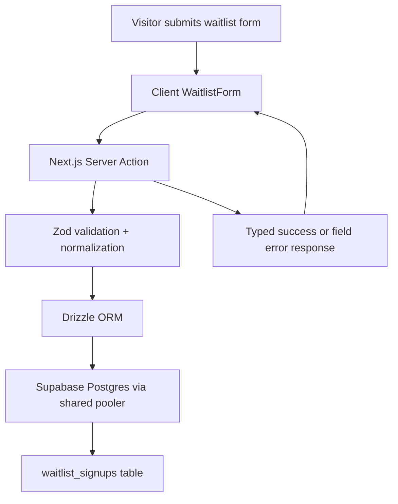

# Supabase Waitlist Plan

## Decision Summary

- Database: Supabase Postgres on the Free Plan.
- ORM: Drizzle ORM with `postgres` driver.
- Mutation path: Next.js Server Action, not a custom API route.
- Validation: Zod on the server, with lightweight client-side UX feedback.
- Migration strategy: Drizzle schema as source of truth, SQL migrations generated by `drizzle-kit`.
- Runtime connection: Supabase shared pooler in transaction mode for app traffic.

This plan keeps the initial setup cheap while avoiding a dead-end architecture. The app writes through an ORM into Postgres today, and can later scale by moving to larger Supabase compute, adding a dedicated pooler or read replicas, and introducing queueing/rate limiting without changing the core data model.

## Why This Stack

- Next.js 16 local docs recommend Server Actions for form-driven UI mutations. The waitlist form is a direct UI mutation, so a Server Action is the narrowest and most maintainable shape.
- Supabase’s Drizzle guide explicitly supports `drizzle-orm + postgres` and recommends the connection pooler for runtime traffic.
- Supabase free tier is sufficient for a landing-page waitlist:
  - 2 free projects per organization
  - 500 MB database size per project
  - daily backups, with manual export recommended for free projects
- Using Drizzle now avoids coupling the write path to Supabase’s generated REST API and gives us a clean schema/migration path if the landing page grows into a broader product backend.

## Architecture



## Dependencies

Install latest stable versions of:

- `drizzle-orm`
- `postgres`
- `zod`
- `drizzle-kit` as a dev dependency

Do not add `@supabase/supabase-js` for the waitlist write path unless we later need auth, storage, or client-side Supabase features. For this feature, direct Postgres via Drizzle is simpler and more scalable.

## Environment Variables

Add a local env template and runtime reads for:

```bash
DATABASE_URL=
```

Use the Supabase Connect dialog and copy the `Shared Pooler` or transaction-mode connection string for runtime usage. Because transaction mode does not support prepared statements, the `postgres` client must be created with:

```ts
postgres(process.env.DATABASE_URL!, { prepare: false })
```

Optional future env vars, not required now:

```bash
TURNSTILE_SECRET_KEY=
RESEND_API_KEY=
WAITLIST_NOTIFICATION_EMAIL=
```

## File Organization

Planned additions:

- `db/schema.ts`
  - Drizzle table definitions.
- `db/client.ts`
  - Shared `postgres` client and `drizzle()` instance.
- `drizzle.config.ts`
  - Drizzle Kit config targeting the schema and migrations folder.
- `drizzle/`
  - Generated SQL migrations and metadata.
- `app/actions/waitlist.ts`
  - Server Action for form submission.
- `lib/waitlist-schema.ts`
  - Zod schema and value normalization helpers.
- `.env.example`
  - Local onboarding env template.

Existing file to modify:

- `components/waitlist-form.tsx`
  - Replace fake timeout success state with real form submission.

## Database Model

Primary table:

```ts
waitlist_signups
```

Columns:

- `id`: `uuid`, primary key, default random UUID
- `created_at`: `timestamp with time zone`, default now
- `email`: `text`, not null
- `full_name`: `text`, not null
- `company`: `text`, nullable
- `role`: `text`, nullable
- `source`: `text`, not null, default `'landing-page'`
- `notes`: `text`, nullable
- `metadata`: `jsonb`, nullable

Constraints and indexes:

- Unique index on normalized email to prevent duplicates.
- Optional index on `created_at desc` for admin export/query ergonomics.

Implementation detail:

- Normalize email to lowercase and trim whitespace before insert.
- Normalize optional strings to `null` when empty.

Drizzle shape:

```ts
export const waitlistSignups = pgTable(
  "waitlist_signups",
  {
    id: uuid("id").defaultRandom().primaryKey(),
    createdAt: timestamp("created_at", { withTimezone: true }).defaultNow().notNull(),
    email: text("email").notNull(),
    fullName: text("full_name").notNull(),
    company: text("company"),
    role: text("role"),
    source: text("source").default("landing-page").notNull(),
    notes: text("notes"),
    metadata: jsonb("metadata").$type<Record<string, unknown> | null>(),
  },
  (table) => [
    uniqueIndex("waitlist_signups_email_unique").on(table.email),
    index("waitlist_signups_created_at_idx").on(table.createdAt),
  ],
);
```

## Validation Contract

Create a shared Zod schema:

```ts
const waitlistSignupSchema = z.object({
  fullName: z.string().trim().min(2).max(120),
  email: z.email().transform((value) => value.trim().toLowerCase()),
  company: z.string().trim().max(120).optional(),
  role: z.string().trim().max(120).optional(),
});
```

Normalization helper:

- Convert empty optional strings to `undefined` or `null`.
- Return a typed object ready for Drizzle insert.

## Server Action Contract

Create `submitWaitlistSignup(formData: FormData)` in `app/actions/waitlist.ts`.

Signature:

```ts
export type WaitlistActionState = {
  status: "idle" | "success" | "error";
  message?: string;
  fieldErrors?: Partial<Record<"fullName" | "email" | "company" | "role", string[]>>;
};
```

Flow:

1. Extract `fullName`, `email`, `company`, and `role` from `FormData`.
2. Validate with Zod.
3. Insert with Drizzle.
4. Handle duplicate email violations by returning a friendly success-like message such as "You're already on the list."
5. Return typed state for the client component to render.

Error handling:

- Do not leak raw database errors to the client.
- Duplicate email should not surface as a server error.
- Unexpected database failures should return a generic failure message and log the error server-side.

## Client Form Changes

Refactor `components/waitlist-form.tsx` to use the Server Action:

- Keep it as a Client Component.
- Use React’s form action pattern with `useActionState`.
- Keep the existing visual design and success panel.
- Replace the simulated timeout with server-driven pending/success/error states.
- Display field-level validation errors under inputs when available.
- Preserve disabled button state during pending submission.

Input naming updates:

- Use `fullName` instead of `name` to align with the schema and server action.

## Drizzle Config

Add `drizzle.config.ts`:

```ts
import { defineConfig } from "drizzle-kit";

export default defineConfig({
  out: "./drizzle",
  schema: "./db/schema.ts",
  dialect: "postgresql",
  dbCredentials: {
    url: process.env.DATABASE_URL!,
  },
});
```

## Migration Workflow

Package scripts to add:

- `db:generate`: generate SQL from schema
- `db:migrate`: apply migrations
- `db:studio`: open Drizzle Studio

Expected workflow:

1. Add schema in `db/schema.ts`
2. Run `npm install` for dependencies
3. Run `npx drizzle-kit generate`
4. Apply the SQL migration against Supabase
5. Verify inserts locally via the form

Because the user wants free tier first with future scale, migrations must live in-repo instead of relying on manual dashboard SQL only.

## Free Tier Now, Scale Later

Free-tier-safe choices:

- Single table with strict validation and unique email constraint.
- Shared pooler / transaction mode connection string.
- No background jobs or external queue yet.
- No auth dependency required.

Scale path without rewrites:

1. Upgrade Supabase compute when write volume or connection pressure increases.
2. Move to a dedicated pooler on paid tiers if lower latency or more isolated runtime traffic is needed.
3. Add Cloudflare Turnstile or similar when spam appears.
4. Add Redis-backed rate limiting if bot traffic becomes material.
5. Add webhook/email side effects through a queue or Edge Function once signup automations are needed.
6. Add internal admin views or exports on top of the same Drizzle schema.

## Non-Goals For This Iteration

- No Supabase Auth.
- No Supabase Storage.
- No email automation.
- No admin dashboard.
- No CRM sync.
- No CAPTCHA unless spam is already a problem.

## Verification

Implementation is complete when:

- `npm run lint` passes.
- `npm run build` passes.
- The form persists new records to Supabase.
- Duplicate emails return a controlled message instead of a crash.
- The repo includes a migration and env template.

## Research Notes

- Supabase Next.js quickstart documents project URL/key setup for SDK use, but for direct ORM writes the key requirement is replaced by a pooled Postgres `DATABASE_URL`.
- Supabase’s Drizzle guide recommends `drizzle-orm`, `postgres`, `drizzle-kit`, and the shared pooler connection.
- Supabase’s Postgres connection guide recommends transaction mode for serverless/temporary clients and notes that prepared statements must be disabled.
- Supabase billing docs state the Free Plan includes two free projects and 500 MB database size per project.
- Supabase backups docs state free projects receive daily backups, while regular external exports are still recommended.
